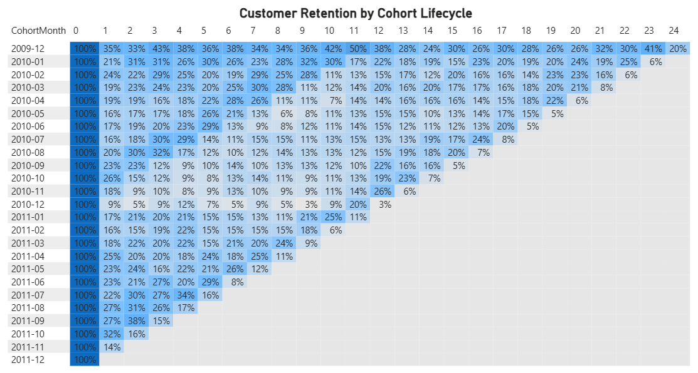
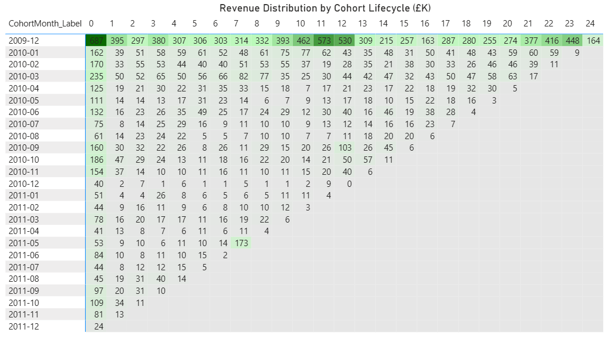
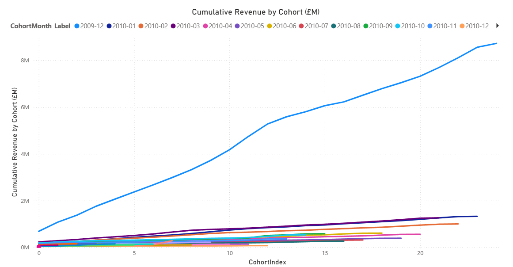

📈 Product Revenue & Retention Analytics

End-to-end analytical project focused on customer lifecycle, retention, revenue concentration, and Lifetime Value (LTV) using a cohort-based methodology.

The project combines Python (data pipeline) and Power BI (executive storytelling) to understand how customer value evolves over time and how retention patterns impact long-term revenue performance.

---

📌 Business Questions

How do customer retention patterns evolve over time?

Do cohorts with higher retention generate more revenue?

How concentrated is revenue across lifecycle stages?

How does Lifetime Value vary across acquisition periods?

How quickly is revenue accumulated after acquisition?

---

📂 Dataset

Source: Kaggle – Online Retail II (UCI)
Scope: Transactional retail data
Granularity: Invoice-level transactions
Period: 2009–2011

Data Quality & Filtering Criteria

Only valid transactions were considered:

Identified customers (Customer ID not null)

Positive quantities (returns excluded)

Positive prices

This ensures analytical integrity by removing refunds and invalid records.

🛠️ Tools & Technologies

Python (Pandas, NumPy)

Jupyter Notebook

Power BI

Git & GitHub

---

🔍 Analytical Methodology
🔹 Time Standardization

All dates were standardized at a monthly level to ensure consistent temporal aggregation for cohort analysis.

🔹 Cohort Definition

Each customer is assigned:

Cohort Month → first purchase month

Cohort Index → months since acquisition

This enables lifecycle-based analysis of retention and revenue.

🔹 Retention Analysis

Customer retention matrices were built at the cohort level and visualized via heatmaps.

This reveals:

Early churn patterns

Engagement decay

Long-term retention stabilization

🔹 Revenue Cohort Analysis

Revenue was aggregated by:

CohortMonth × CohortIndex


Allowing analysis of:

Revenue concentration

Lifecycle monetization

Expansion vs decay patterns

Revenue analysis showed that retained users do not contribute equally to revenue — highlighting value concentration effects.

🔹 Lifetime Value (LTV)

Observed LTV per cohort:

LTV = Total Cohort Revenue / Cohort Size


Key findings:

Early cohorts exhibit higher LTV due to longer observation windows

Later cohorts show more stable monetization patterns

---

⚠️ Analytical Integrity Refactor

During BI integration, aggregation inconsistencies were identified:

Revenue overcounting

Many-to-many joins

Inflated KPIs

The pipeline was rebuilt with:

Strict cohort granularity

Clean aggregation layers

BI-safe exports

📦 BI-Ready Outputs

Located in:

data/processed/


Files:

cohort_retention.csv

cohort_revenue.csv

ltv_cohort.csv

Designed to minimize DAX complexity and keep business logic centralized in Python.

---

📊 Power BI Dashboard
The Power BI dashboard translates cohort analytics into an executive storytelling layer, enabling visualization of customer lifecycle behavior, retention decay, and revenue accumulation dynamics.

It is structured into three analytical perspectives:

🔹 Retention Heatmap

This visualization shows customer retention rates across lifecycle months for each acquisition cohort.

Key patterns observed:

Retention drops sharply after the first purchase.

Most cohorts stabilize between 10–25% retention after Month 3.

Early lifecycle engagement is the strongest predictor of long-term retention.

Executive interpretation:

Customer churn is heavily concentrated in the first months after acquisition, highlighting the importance of onboarding and early engagement strategies.



🔹 Revenue Distribution Heatmap

This heatmap displays how revenue is distributed across lifecycle stages for each cohort.

Key insights:

Revenue is highly concentrated in the first 3–6 months.

Monetization intensity declines significantly after Month 6.

Cohorts with higher early retention generate more revenue.

Executive interpretation:

Revenue generation is front-loaded, indicating that early lifecycle monetization strategies are critical for maximizing customer value.



🔹 Cumulative Revenue Curve

This chart illustrates revenue accumulation over time by acquisition cohort.

Key findings:

Earlier cohorts accumulate significantly more revenue.

Revenue growth is steep in early months and slows after ~12 months.

Long-term monetization expansion is limited.

Executive interpretation:

Lifetime Value is primarily driven by early retention and repeat purchase frequency rather than long-term expansion.



---

🧠 Consolidated Executive Insights

From the combined dashboard analysis:

Revenue is heavily front-loaded in the early lifecycle.

Retention decays rapidly after acquisition.

Early retention strongly predicts Lifetime Value.

Revenue expansion slows after the first year.

Acquisition quality varies across cohorts.

These findings suggest that improving onboarding, engagement, and early repeat purchase incentives would likely generate higher ROI than focusing exclusively on new customer acquisition.

---

🧱 Architectural Design
Layer	Tool	Responsibility
ETL	Python	Data cleaning & cohort logic
Metrics	Python	Retention & LTV
KPIs	DAX	Executive aggregation
Visualization	Power BI	Storytelling

Ensures scalability and analytical integrity.

---

📁 Project Structure
```
product-revenue-analytics/
├── data/
│   ├── raw/
│   │   └── online_retail_II.csv
│   └── processed/
│       ├── cohort_retention.csv
│       ├── cohort_revenue.csv
│       └── ltv_cohort.csv
├── notebooks/
│   └── cohort_retention_analysis.ipynb
├── powerbi/
│   └── product_revenue_dashboard.pbix
├── images/
│   ├── retention_heatmap.png
│   ├── revenue_heatmap.png
│   └── cumulative_revenue.png
├── README.md
├── requirements.txt
└── .gitignore
```
---